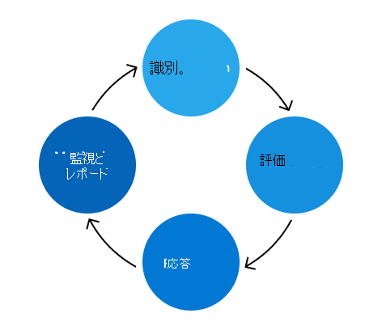

#  Microsoft 365 のリスク管理のプログラムMicrosoft 365 Risk Management program

リスク管理プログラムMicrosoft 365目的は、リスクを特定、評価、および管理Microsoft 365。The purpose of the Microsoft 365 Risk Management program is to identify, assess, and manage risks to Microsoft 365. Microsoft 365の優先事項は、契約上の義務と認定を満たし、顧客の信頼を高め、競争力を維持します。Microsoft 365's priority is to meet contractual obligations and accreditations, increase customer trust, and maintain our competitive edge. Microsoft 365リスク管理プログラムは独立して機能しますが、包括的な Enterprise リスク管理 (ERM) プログラムのポリシー、優先順位、および方法に合わせて調整されます。While the Microsoft 365 Risk Management program functions independently, it aligns with the overarching Enterprise Risk Management (ERM) program's policies, priorities, and methodologies. ERM プログラムを使用すると、ビジネス ユニットとエンジニアリング グループ間で一貫した比較が可能になります。企業全体のリスク管理に対するより一貫性のあるアプローチに貢献します。Working with the ERM program allows for consistent comparison across business units and engineering groups, contributing to a more cohesive approach to risk management across the enterprise.

セキュリティMicrosoft 365チームは、リスク管理プログラムMicrosoft 365、ERM プログラムによってレイアウトされたアクティビティを実行する責任があります。The Microsoft 365 Trust team is responsible for managing the Microsoft 365 Risk Management program and conducting the activities laid out by the ERM program. 信頼チームは、リスク管理プログラムをより効果的かつ効率的に行うMicrosoft 365エンジニアリング、サービス運用、コンプライアンス プロセスにリスク管理フレームワークを統合します。The Trust team focuses on integrating the risk management framework with existing Microsoft 365 engineering, service operations, and compliance process to make the Risk Management program more effective and efficient.

また、信頼チームは Microsoft 365 Controls Framework を維持しています。一連の合理化されたコントロールは、コンプライアンス活動をサポートして適切に実装すると、エンジニアリング チームが主要な規制と認定に準拠できます。The Trust team also maintains the Microsoft 365 Controls Framework, a set of rationalized controls that, when properly implemented with supporting compliance activities, allows engineering teams to comply with key regulations and certifications. このフレームワークは、リスク管理プロセスの一環としてフィードバックと調査結果に基づいて継続的に更新されます。This framework is continuously updated based on feedback and findings as part of the risk management process.

リスク管理アクティビティは、識別、評価、対応、監視と報告の 4 つのフェーズに分かっています。Risk management activities fall into four phases: identification, assessment, response, and monitoring and reporting.

## IDIdentification

リスク管理プロセスは、すべての主要な制御領域、内部および外部の脅威、およびセキュリティ環境の脆弱性に対して考えられるすべてのリスクをMicrosoft 365します。The risk management process starts with identifying all possible risks to all key control areas, internal and external threats, and vulnerabilities in the Microsoft 365 environment. このプロセスを導く情報は、インタビュー、脆弱性スキャン、攻撃シミュレーション演習、監査結果、インシデント管理アクティビティなど、複数のソースから取得されます。The information guiding this process comes from multiple sources including interviews, vulnerability scans, attack simulation exercises, audit findings, and incident management activities.

信頼チームは、以前に特定されたリスクと、サービスの成長に伴って導入される可能性のある将来のリスクについて、複数のサービス チームから件名の専門家 (SMEs) にインタビューします。The Trust team interviews subject matter experts (SMEs) from multiple service teams on previously identified risks and potential future risks that may be introduced as the services grow. さらに、中小企業は、他の継続的な監視ソースから特定されたリスクの正確性と完全性を検証するのに役立ちます。Additionally, SMEs help to validate the accuracy and completeness of risks identified from the other continuous monitoring sources.

また、意思決定ログ、アクティブ なセキュリティとコンプライアンスの例外、以前のリスク評価からの軽減作業を確認する場合も識別フェーズです。The identification phase is also when decision logs, active security and compliance exceptions, and mitigation work from previous risk assessments are reviewed.

## 評価Assessment

特定された各リスクは、影響、可能性、および制御の欠陥という 3 つの指標を使用して評価されます。Each identified risk is assessed using three metrics: impact, likelihood, and control deficiency.

- 影響とは、そのリスクを実現する場合にサービス、ビジネス、または Microsoft に発生する損害を指します。Impact refers to the damage that would occur to the service, business, or Microsoft if that risk were to be realized. Microsoft への影響には、評判の損害、顧客の喪失、法令遵守への影響が含まれる場合があります。The impact to Microsoft may include damage to reputation, loss of customers, or legal/compliance implications.
- 可能性は、潜在的なリスクが実現される確率を定義し、発生する確率と頻度を分析することによって計算されます。Likelihood defines the probability of the potential risk being realized and is calculated by analyzing the probability and frequency with which it will occur.
- コントロールの不足は、実装された軽減制御の有効性を測定します。Control deficiency measures the effectiveness of implemented mitigation controls.

これらの指標は、既存の軽減戦略を説明し、各リスクの重大度を表すリスク スコアを計算するために使用されます。These metrics are used to calculate a risk score that represents the severity of each risk, accounting for existing mitigation strategies. リスクは、各サービスの主要な関係者に集約され、各サービスの主要な関係者に提示され、Microsoft 365のリスク態勢の正確性と完成度を確認します。Risks are aggregated and presented to key stakeholders from each service to verify the accuracy and completeness of Microsoft 365's risk posture.

## 応答Response

信頼チームは、リスクの検証済みリストを使用Microsoft 365、影響を受けるサービスにリスクを割り当て、リスク対応を行います。Using the verified list of risks to Microsoft 365, the Trust team assigns risks to the affected service for risk response. 定義されたガイドラインは、リスク スコアと制御の有効性に基づいて適切なリスク対応戦略を決定するのに役立ちます。Defined guidelines help determine the appropriate risk response strategy based on the risk score and control effectiveness. リスク対応戦略は、次の 4 つのカテゴリに分類されます。Risk response strategies fall into four categories:

- 許容: 漏えいの危険度が低い領域で、制御レベルも低い場合。Tolerate: Areas of low-risk exposure with a low level of control.
- 処理: 漏えいの危険度が低い領域で、制御が適切だとみなされる場合。Operate: Areas of low-risk exposure where controls are deemed adequate.
- 監視: 漏えいの危険度が高い領域で、制御が適切であり、監視が有効だとみなされる場合。Monitor: Areas of high-risk exposure where controls are deemed adequate and should be monitored for effectiveness.
- 改善: 対処の最優先事項である低レベルの制御を伴うリスクの高い露出の領域。Improve: Areas of high-risk exposure with a low level of control that are top priorities in addressing.

信頼チームは、サービス チームと調整して、各リスクに対処する計画を策定します。The Trust team coordinates with service teams to develop plans for addressing each risk. 重大度レベルは、各計画の適切なレベルのレビューと承認を決定します。The severity level determines the appropriate level of review and approval for each plan. アクションが必要なリスクについては、既存のエンジニアリング バグ プロセスを使用して、例外の決定を追跡、管理、および行います。For risks that require action, existing engineering bug processes are used for tracking, managing, and making exception decisions. エンジニアリングチームと運用チームに慣れ親しんだプロセスを使用すると、リスク対応の効率と効率が向上します。Using a process familiar to the engineering and operation teams makes risk response more efficient and effective.

## 監視とレポートMonitoring and reporting

リスク評価の一環として特定されたリスクを監視し、関連する関係者へと報告を行います。Risks identified as part of the risk assessment are monitored and reported to relevant stakeholders. 監視戦略には、セキュリティの監視、定期的なリスクの確認、侵入テスト、脆弱性のスキャンが含まれます。Monitoring strategies include security monitoring, periodic risk reviews, penetration testing, and vulnerability scanning. これらの監視の取り組みは、主要業績評価指標に関するレポート作成、ダッシュボードの作成、および正式なレポートの開発のためのデータ ソースとして機能し、そのすべてが将来のリスクの決定を通知します。These monitoring efforts act as data sources for reporting on key performance indicators, creating dashboards, and developing formal reports, all of which inform future risk decisions.

年に複数回、信頼チームは各サービスのリスク所有者と会い、リスク スコアを確認し、アクション プランの有効性を評価し、必要に応じて更新を行います。Multiple times a year, the Trust team meets with risk owners from each service to review risk scores, evaluate the effectiveness of their action plans, and make updates where needed. さらに、Microsoft 365 のリスク評価活動は、Microsoft の上級管理職および ERM プログラムに対する Microsoft のリスク態勢の概要を示す、ERM プログラムの Enterprise リスク評価に貢献します。In addition, Microsoft 365's risk assessment activities contribute to the ERM program's Enterprise Risk Assessments, which provide a high-level overview of Microsoft's risk posture to Microsoft senior management and the ERM program.
