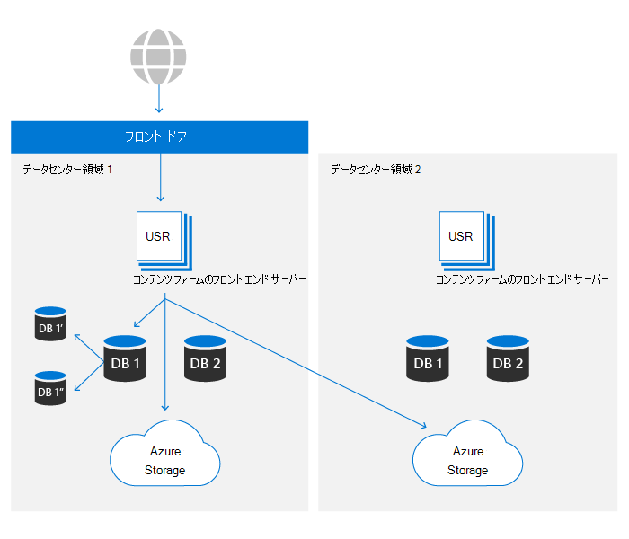
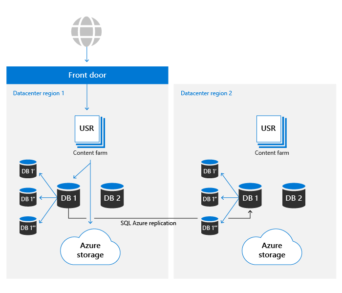

# Microsoft 365 での SharePoint と OneDrive のデータの復元性SharePoint and OneDrive data resiliency in Microsoft 365

Microsoft 365 では、OneDrive は SharePoint ファイル プラットフォームの上に構築されています。Within Microsoft 365, OneDrive is built on top of the SharePoint file platform. この記事では、SharePoint のみを使用して両方の製品を参照します。In this article, only SharePoint will be used to refer to both products. この記事の内容は Microsoft 365 に関連し、コンシューマー サービスには適用されません。The contents of this article are relevant to Microsoft 365 and do not apply to consumer services.

SharePoint のコア コンテンツ ストレージを構成する 2 つの主なアセットがあります。There are two primary assets that make up the core content storage of SharePoint:

- **メタデータ**: 各ファイルに関するメタデータは、Azure SQLデータベースに格納されます。**Metadata**: Metadata about each file is stored in Azure SQL Database. Azure SQL SharePoint が使用する完全なビジネス継続性ストーリーと詳細については、この記事の後半で説明します。Azure SQL offers a complete business continuity story that SharePoint uses and details are covered later in this article.
- **BLOB ストレージ**: SharePoint にアップロードされたユーザー コンテンツは、Azure Storage に格納されます。**Blob storage**: User content that is uploaded into SharePoint is stored in Azure Storage. SharePoint は、ユーザー コンテンツのほぼリアルタイムの重複と、本当にアクティブ/アクティブなシステムを確保するために、Azure Storage の上にカスタムの復元計画を構築しました。SharePoint has built a custom resiliency plan on top of Azure Storage to ensure near real-time duplication of user content and a truly active/active system.

データの回復性を確保するためのコントロールの完全なセットについては、詳細なセクションで説明します。The complete set of controls to ensure data resiliency is explained in further sections.

## BLOB ストレージの復元Blob storage resilience

SharePoint には、Azure Storage に顧客データを保存するカスタムビルド ソリューションがあります。SharePoint has a custom-built solution for storage of customer data in Azure Storage. すべてのファイルは、プライマリ データセンター領域とセカンダリ データセンター領域の両方に同時に書き込まれます。Every file is simultaneously written into both a primary and a secondary datacenter region. いずれかの Azure 領域への書き込みに失敗すると、ファイルの保存は失敗します。If writes to either Azure region fail, the file save will fail. コンテンツが Azure Storage に書き込まれると、チェックサムはメタデータと個別に格納され、コミットされた書き込みは、将来のすべての読み取り中に SharePoint に送信された元のファイルと同じになります。After the contents are written into Azure Storage, checksums are stored separately with metadata, and are used to ensure that the committed write is identical to the original file sent to SharePoint during all future reads. この同じ手法は、発生する必要がある破損の伝達を防止するために、すべてのワークフローで使用されます。This same technique is used in all workflows to prevent propagation of any corruption that should occur. 各地域内で、Azure Locally Redundant Storage (LRS) は高レベルの信頼性を提供します。Within each region, Azure Locally Redundant Storage (LRS) provides a high level of reliability. 詳細については [、「Azure Storage の冗長性」](/azure/storage/common/storage-redundancy-lrs) の記事を参照してください。See the [Azure Storage redundancy](/azure/storage/common/storage-redundancy-lrs) article for details.

SharePoint では、ストレージAppend-Only使用します。SharePoint uses Append-Only storage. このプロセスにより、初期保存後にファイルを変更したり破損したりすることはできませんが、製品内バージョン管理を使用すると、以前のバージョンのファイルコンテンツを取得できます。This process ensures that files cannot be changed or corrupted after an initial save, but also by using in-product versioning, any previous version of the file contents can be retrieved.

どちらのデータセンターの SharePoint 環境でも、両方の Azure リージョンのストレージ コンテナーにアクセスできます。SharePoint environments in either datacenter can access storage containers in both Azure regions. パフォーマンス上の理由から、同じローカル データセンター内のストレージ コンテナーが常に優先されます。ただし、目的のしきい値内に結果が表示されない読み取り要求は、データが常に使用可能なことを確認するために、リモート データセンターから要求されたコンテンツと同じになります。For performance reasons the storage container in the same local datacenter is always preferred, however, read requests that do not see results within a desired threshold will have the same content requested from the remote datacenter to ensure data is always available.

## メタデータの復元Metadata resilience

SharePoint メタデータは、Azure Storage に格納されているコンテンツの場所とアクセス キーを格納するユーザー コンテンツにアクセスする場合にも重要です。SharePoint metadata is also critical to accessing user content as it stores the location of and access keys to the content stored in Azure Storage. これらのデータベースは Azure SQLに格納され、広範なビジネス継続 [性計画があります](/azure/sql-database/sql-database-business-continuity)。These databases are stored in Azure SQL, which has an extensive [business continuity plan](/azure/sql-database/sql-database-business-continuity).

SharePoint は Azure SQL が提供するレプリケーション モデルを使用し、独自のオートメーション テクノロジを構築してフェールオーバーが必要かどうかを判断し、必要に応じて操作を開始します。SharePoint uses the replication model provided by Azure SQL and has built a proprietary automation technology to determine a failover is required and to initiate the operation if necessary. そのため、Azure の観点から見ると、"手動データベース フェールオーバー" カテゴリSQLされます。As such, it falls into the 'Manual database failover' category from an Azure SQL perspective. データベースの回復性に関する Azure SQLの指標については、こちらを参照 [してください](/azure/azure-sql/database/business-continuity-high-availability-disaster-recover-hadr-overview#recover-a-database-to-the-existing-server)。The latest metrics for Azure SQL database recoverability are available [here](/azure/azure-sql/database/business-continuity-high-availability-disaster-recover-hadr-overview#recover-a-database-to-the-existing-server).

SharePoint は Azure SQL のバックアップ システムを使用して、ポイント イン タイム 復元 (PITR) を最大 14 日間有効にしています。SharePoint uses Azure SQL's backup system to enable Point in Time Restores (PITR) for up to 14 days. PITR の詳細については、後のセクション [で説明します。](#deletion-backup-and-point-in-time-restore)PITR is covered more in a [later section.](#deletion-backup-and-point-in-time-restore)

## 自動フェールオーバーAutomated failover

SharePoint は、カスタムビルドの自動フェールオーバーを使用して、場所固有のイベントが発生した場合のカスタマー エクスペリエンスへの影響を最小限に抑えます。SharePoint uses a custom-built automated failover to minimize the impact on customer experience when a location-specific event occurs. 特定のしきい値を超える単一または複数コンポーネントの障害を検出する監視駆動型の自動化により、すべてのユーザーのアクティビティが問題のある環境からウォーム セカンダリに自動的にリダイレクトされます。Monitoring-driven automation detecting a single or multi-component failure beyond certain thresholds will result in automated redirection of all users' activity out of the problematic environment and over to a warm secondary. フェールオーバーによって、メタデータとコンピューティング ストレージが新しいデータセンターから完全に提供されます。A failover results in metadata and compute storage being served entirely out of the new datacenter. BLOB ストレージは常に完全にアクティブ/アクティブに実行されます。フェールオーバーには変更は必要ありません。As blob storage always runs entirely active/active, no change is required for a failover. コンピューティング層は最も近い BLOB コンテナーを優先しますが、可用性を確保するために、いつでもローカルとリモートの両方の BLOB ストレージの場所を使用します。The compute tier will prefer the nearest blob container but will use both local and remote blob storage locations at any time to ensure availability.

SharePoint は Azure Front Door サービスを使用して、Microsoft ネットワークへの内部ルーティングを提供します。SharePoint uses the Azure Front Door service to provide routing internal to the Microsoft network. この構成により、DNS に依存しないフェールオーバー リダイレクトが可能であり、ローカル マシン キャッシュの影響が軽減されます。This configuration allows failover redirection independent of DNS and reduces the effect of local-machine caching. ほとんどのフェールオーバー操作は、エンド ユーザーに対して透過的です。Most failover operations are transparent to end users. フェールオーバーがある場合は、サービスへのアクセスを維持するために変更を加える必要が生じしません。If there is a failover, customers will not need to make any changes in order to maintain access to the service.

## バージョン管理とファイルの復元Versioning and Files Restore

新しく作成されたドキュメント ライブラリの場合、SharePoint は既定ですべてのファイルで 500 バージョンに設定され、必要に応じてさらにバージョンを保持するように構成できます。For newly created document libraries, SharePoint defaults to 500 versions on every file and can be configured to retain more versions if desired. UI では、100 バージョン未満の値を設定できますが、パブリック API を使用してより少ないバージョンを格納するシステムを設定できます。The UI doesn't allow a value fewer than 100 versions to be set, but it is possible to set the system to store fewer versions using public APIs. 信頼性を確保するには、100 未満の値は推奨されません。ユーザー アクティビティによってデータが不注意に失われる可能性があります。For reliability, any value less than 100 isn't recommended and can result in user activity causing inadvertent data loss.

バージョン管理の詳細については [、「Versioning in SharePoint」を参照してください](/microsoft-365/community/versioning-basics-best-practices)。For more information about versioning, see [Versioning in SharePoint](/microsoft-365/community/versioning-basics-best-practices).

ファイルの復元は、過去 30 日間に SharePoint の任意のドキュメント ライブラリで 2 番目の時間に戻る機能です。Files Restore is the ability to go 'back in time' on any Document Library in SharePoint to any second of time in the last 30 days. このプロセスは、ランサムウェア、大量削除、破損、その他のイベントから回復するために使用できます。This process can be used to recover from ransomware, mass deletions, corruption, or any other event. この機能ではファイル バージョンが使用されます。そのため、既定のバージョンを減らすと、この復元の効果が低下します。This feature uses file versions so reducing default versions can reduce the effectiveness of this restore.

ファイルの復元機能は[、OneDrive と SharePoint の両方](https://support.office.com/article/restore-your-onedrive-fa231298-759d-41cf-bcd0-25ac53eb8a15)[について文書化されています](https://support.office.com/article/Restore-a-document-library-317791c3-8bd0-4dfd-8254-3ca90883d39a)。The Files Restore feature is documented for both [OneDrive](https://support.office.com/article/restore-your-onedrive-fa231298-759d-41cf-bcd0-25ac53eb8a15) and [SharePoint](https://support.office.com/article/Restore-a-document-library-317791c3-8bd0-4dfd-8254-3ca90883d39a).

## 削除、バックアップ、およびポイントインタイムの復元Deletion, backup, and Point in Time Restore

SharePoint から削除されたユーザー コンテンツは、次の削除フローを通過します。User content deleted from SharePoint goes through the following deletion flow.

削除されたアイテムは、一定の期間、ごみ箱に保持されます。Deleted items are retained in recycle bins for a certain period of time. SharePoint の場合、保持時間は 93 日です。For SharePoint, the retention time is 93 days. 元の場所からアイテムを削除すると開始されます。It begins when you delete the item from its original location. サイトのごみ箱からアイテムを削除すると、サイト コレクションのごみ箱 [に移動します](https://support.office.com/article/restore-deleted-items-from-the-site-collection-recycle-bin-5fa924ee-16d7-487b-9a0a-021b9062d14b)。When you delete the item from the site recycle bin, it goes into the [site collection recycle bin](https://support.office.com/article/restore-deleted-items-from-the-site-collection-recycle-bin-5fa924ee-16d7-487b-9a0a-021b9062d14b). 残りの 93 日間はそのまま残り、完全に削除されます。It stays there for the remainder of the 93 days, and then is permanently deleted. ごみ箱を使用する方法の詳細については、次のリンクを参照してください。More information about how to use the recycle bin is available at these links:

- [ごみ箱のアイテムを復元するRestore items in the Recycle Bin](https://support.office.com/article/Restore-items-in-the-Recycle-Bin-of-a-SharePoint-site-6df466b6-55f2-4898-8d6e-c0dff851a0be)
- [サイト コレクションのごみ箱から削除済みアイテムを復元します](https://support.office.com/article/Restore-deleted-items-from-the-site-collection-recycle-bin-5fa924ee-16d7-487b-9a0a-021b9062d14b)。[Restore deleted items from the Site Collection Recycle Bin](https://support.office.com/article/Restore-deleted-items-from-the-site-collection-recycle-bin-5fa924ee-16d7-487b-9a0a-021b9062d14b).

このプロセスは既定の削除フローであり、保持ポリシーやラベルは考慮されません。This process is the default deletion flow and does not take into account retention policies or labels. 詳細については [、「SharePoint および OneDrive の保持について」を参照してください](/microsoft-365/compliance/retention-policies-sharepoint)。For more information, see [Learn about retention for SharePoint and OneDrive](/microsoft-365/compliance/retention-policies-sharepoint).

93 日間のリサイクル パイプラインが完了すると、メタデータと BLOB ストレージに対して個別に削除が行います。After the 93-day recycle pipeline is complete, deletion takes place independently for Metadata and for Blob Storage. メタデータはデータベースからすぐに削除され、バックアップからメタデータが復元されていない限り、コンテンツは読み取り不能になります。Metadata will be removed immediately from the database, which makes the content unreadable unless the metadata is restored from backup. SharePoint は、メタデータのバックアップを 14 日間保持します。SharePoint maintains 14 days-worth of backups of metadata. これらのバックアップは、ほぼリアルタイムでローカルに作成され、冗長な Azure Storage コンテナーのストレージにプッシュされます。このドキュメントの時点では、5 分から 10 分のスケジュールです。These backups are taken locally in near real time and then pushed to storage in redundant Azure Storage containers on, [according to documentation](/azure/sql-database/sql-database-automated-backups) at the time of this publication, a 5-10-minute schedule.

Blob Storage コンテンツを削除する場合、SharePoint は Azure Blob Storage のソフト削除機能を利用して、偶発的または悪意のある削除から保護します。When deleting Blob Storage content, SharePoint utilizes the soft delete feature for Azure Blob Storage to protect against accidental or malicious deletion. この機能を使用すると、完全に削除される前にコンテンツを復元する合計 14 日間があります。Using this feature, we have a total of 14 days in which to restore content before it is permanently deleted.

>[!Note]
>Microsoft アプリケーションは標準プロセスのごみ箱にコンテンツを送信しますが、SharePoint は、ごみ箱をスキップして即時削除を行う API を提供します。While Microsoft applications will send content to the recycle bin for the standard process, SharePoint does provide APIs that allow for skipping the recycle bin and forcing an immediate delete. アプリケーションを確認して、コンプライアンス上の理由から必要な場合にのみ行われることを確認します。Review your applications to ensure this is only done when necessary for compliance reasons.

## 整合性チェックIntegrity Checks

SharePoint では、さまざまなメソッドを使用して、データ ライフサイクルのすべての段階で BLOB とメタデータの整合性を確保します。SharePoint uses various methods to ensure the integrity of blobs and metadata at all stages of the data lifecycle:

- **メタデータに格納されたファイル ハッシュ**: ファイル全体のハッシュがファイル メタデータと一緒に格納され、すべての操作中にドキュメント レベルのデータ整合性が維持されます。**File hash stored in metadata**: Hash of the entire file is stored with file metadata to ensure document level data integrity is maintained during all operations
- **メタデータに格納された** BLOB ハッシュ: 各 BLOB アイテムには、暗号化されたコンテンツのハッシュが格納され、基になる Azure ストレージの破損から保護されます。**Blob hash stored in metadata**: Each blob-item stores a hash of the encrypted content to protect against corruption in underlying Azure storage.
- **データ整合性ジョブ**: 14 日ごとに、データベース内のアイテムを一覧表示し、それらのアイテムを Azure ストレージのリストされた BLOB と照合することで、各サイトが整合性をスキャンされます。**Data integrity job**: Every 14 days, each site is scanned for integrity by listing items in the database and matching those up with listed blobs in Azure storage. ジョブは、ストレージ BLOB が不足している BLOB 参照を報告し、必要に応じて Azure ストレージのソフト削除機能を使用してそれらの [BLOB](/azure/storage/blobs/soft-delete-blob-overview) を取得できます。The job reports any blob-references missing storage-blobs and can retrieve those blobs through the [Azure storage soft-delete](/azure/storage/blobs/soft-delete-blob-overview) feature if needed.
